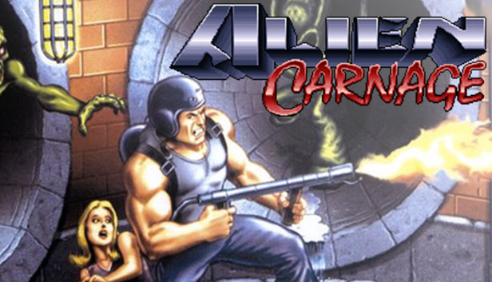
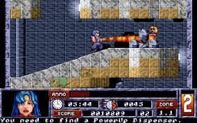
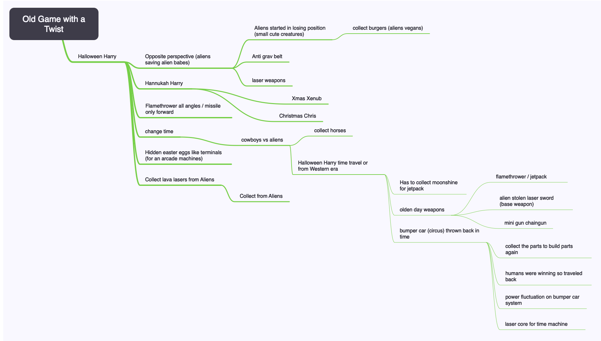

The theme for the Pygame Community Summer Team Jam has been announced - "Old Game with a Twist"!

We got together over a live stream to ideate. We're all fans of Halloween Harry / Alien Carnage so thought it'd be cool to explore how we could create a similar game using the same mechanics and themes but with a twist.

 

We like the fact you have a jetpack, flamethrower and missiles in the game, as well as the fact it was about exploring and finding secrets to progress to the next level

Here's our ideation mindmap:

We're leaning towards an time travel western spin on Halloween Harry / Alien Carnage with some unique weapons for that time. Let's see how we go!

We'll continuously on/off stream on the Devs in the Shed channel: https://www.youtube.com/channel/UCATTlKEKPeLYrGb1otqMc8Q

Wish us luck!

--

Find out more about the Pygame Community Summer Team Jam: https://itch.io/jam/pygame-community-summer-team-jam

Join the Pygame Discord to see what other teams are working on and chat with the wider Pygame community: https://discordservers.com/server/772505616680878080